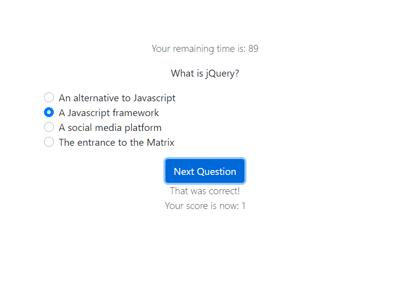

# Title

Javascript knowledge check quiz

A timed 5 question quiz designed to test the user on JavaScript knowledge. Keeps the user's score and penalizes time for missed questions.

 

# Installation

A live Deployment can be found here: <a href="https://nboutin109.github.io/Javascript-knowledge-quiz/">https://nboutin109.github.io/Javascript-knowledge-quiz/</a>

To use locally, simply download the files and open the index.html file with an internet browser

## Built With
<ul>
<li>jQuery - CDN link included</li>
<li>Bootstrap - CDN link included</li>
</ul>

## Code Overview
 The index.html file is rendered by the browser and styled with the included .css file and Bootstrap. The script.js page hides the original page and renders the first question when the start button is clicked, while also starting a timer. The html values of the divs containing the question and answers are replaced each time the next button is clicked, and missing a question will subtract 15 seconds from the remaining time. The quiz ends when time runs out or all 5 questions are answered and the score is then displayed.

